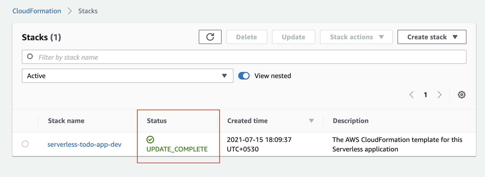
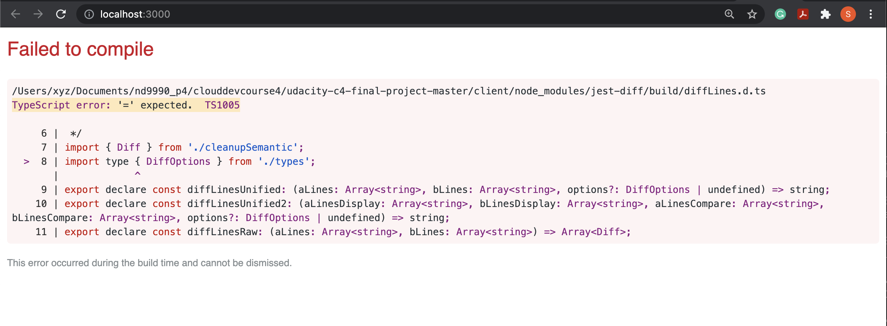
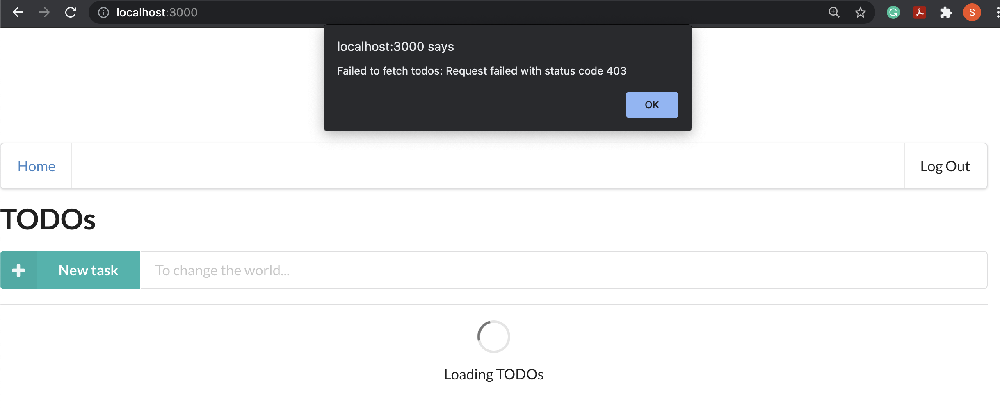
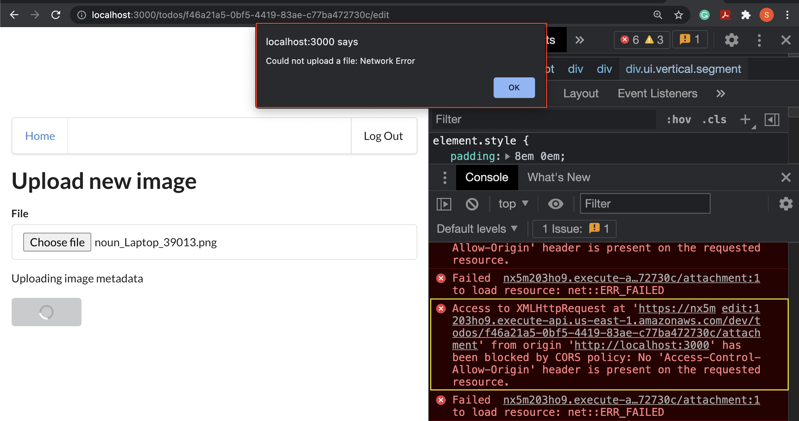
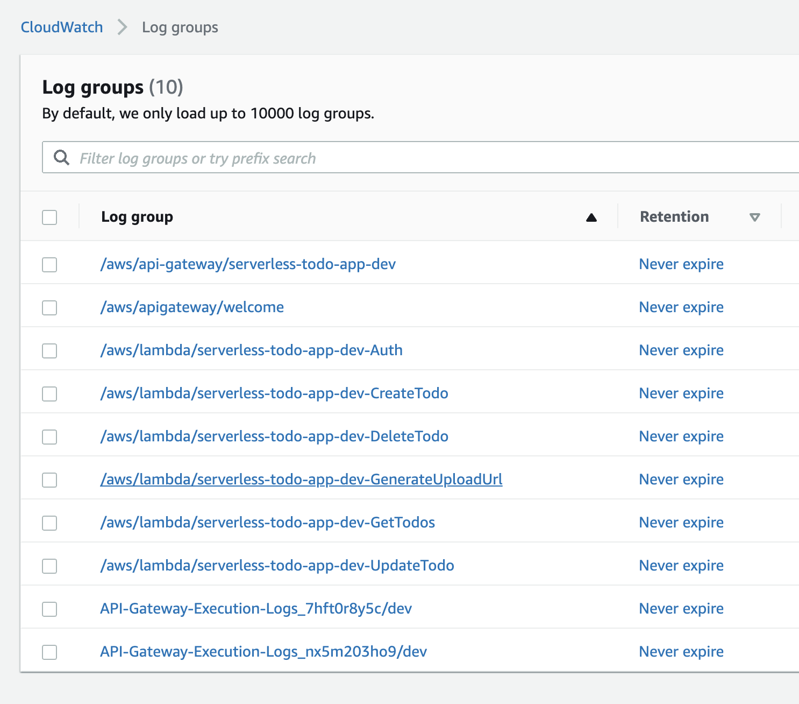
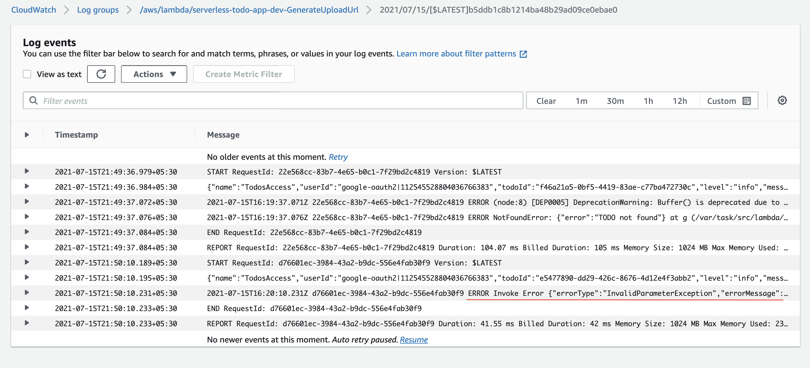
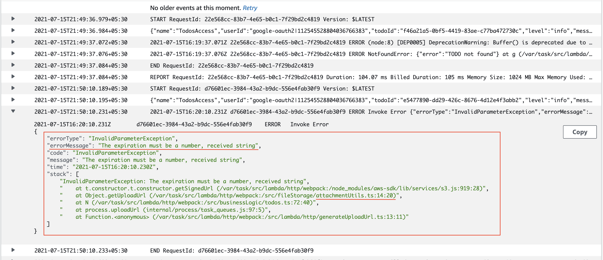
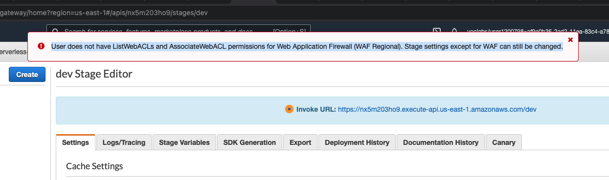

# Project Overview
In this project, we develop and deploy a simple "TODO" application using AWS Lambda and Serverless Framework. This
project focuses on the DevOps journey to deploying the application on AWS.

## Prerequisites
- Auth0 account
- GitHub account
- NodeJS version up to 12.xx
  - Serverless
      - Create a Serverless account user
      - Install the Serverless Framework’s CLI (up to VERSION=2.21.1). Refer to the official documentation for more help.

              npm install -g serverless@2.21.1

              serverless --version
      - Login and configure serverless to use the AWS credentials

              # Login to your dashboard from the CLI. It will ask to open your browser and finish the process.

              serverless login

              # Configure serverless to use the AWS credentials to deploy the application

              # You need to have a pair of Access key (YOUR_ACCESS_KEY_ID and YOUR_SECRET_KEY) of an IAM user with Adminaccess permissions

              sls config credentials --provider aws --key YOUR_ACCESS_KEY_ID --secret YOUR_SECRET_KEY --profile serverless

## Deploy Backend
            cd backend

            npm install

            npm install --save-dev serverless-iam-roles-per-function@next 

            # For the first time, create an application in your org in Serverless portal

            serverless

            # Next time, deploy the app and note the endpoint url in the end

            serverless deploy --verbose

            # sls is shorthand for serverless

            # -v is shorthand for --verbose

If the deployment is successful, then you can:
- Check the Serverless dashboard update
- Check the AWS resources - API Gateway, S3, Lambda, CloudWatch logs
- Verify the endpoints
Otherwise, see the Troubleshooting tips on the page next.

 A successful deployment

# Deploy Frontend

            cd client
            
            npm install

            npm run start

The client folder contains a web application that can use the API that should be developed in the project.

To use it please edit the config.ts file in the client folder:

                const apiId = '...' API Gateway id
                export const apiEndpoint = `https://${apiId}.execute-api.us-east-1.amazonaws.com/dev`

                export const authConfig = {
                domain: '...',    // Domain from Auth0
                clientId: '...',  // Client id from an Auth0 application
                callbackUrl: 'http://localhost:3000/callback'
                }

## Troubleshoot
- Make sure the `serverless deploy --verbose` did not emit any errors.
- Failed to compile after running the frontend. This is mostly due to NodeJS dependencies used in your frontend package.json file

 (Frontend) Error due to typescript dependency compatibility
- Status code 403 error while fetching a resource occurs due to unauthorized access. Check your:
  - backend/src/lambda/auth/auth0Authorizer.ts file.
  - domain and clientId in the client/src/config.ts file.

 (Backend API) Unauthorized access error due to not setting up the URL that can be used to download the Auth0 certificate
- CORS error or error while uploading your image file may occur due to many reasons:
    - CORS is not set correctly in the Lambda functions
    - CORS is not set in the API Gateway
    - CORS is not set at the S3 bucket level permissions
    - apiId is not set correctly in the client/src/config.ts file.
    - Sometimes other errors, that can only be traced in the CloudWatch logs. See an example below.

 CORS error while trying to upload the image.
It says No 'Access-Control-Allow-Origin' header is present on the requested resource.
- Check your CloudWatch log groups. In the example below, it shows that a CORS error occurred due to a data type mismatch in the backend/src/helpers/attachmentUtils.ts file.

Check your AWS CloudWatch log groups

 Log events in a particular Log group

 Details of an error

 Error at AWS API Gateway, faced by Vocareum users

Feel free to reach out to me via email for any queries.